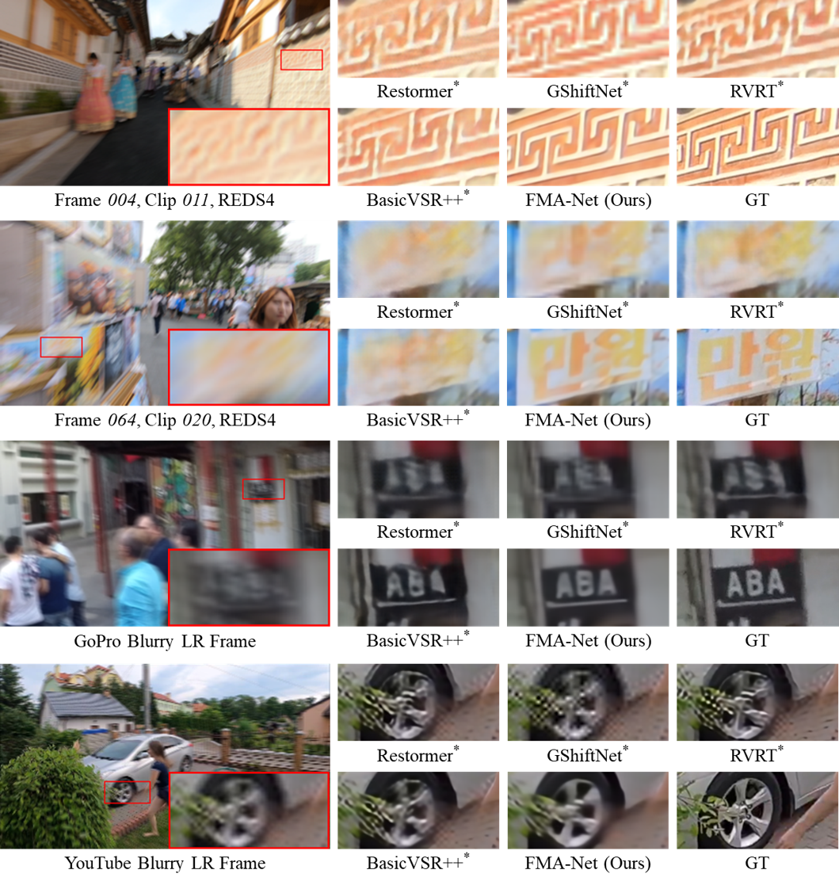
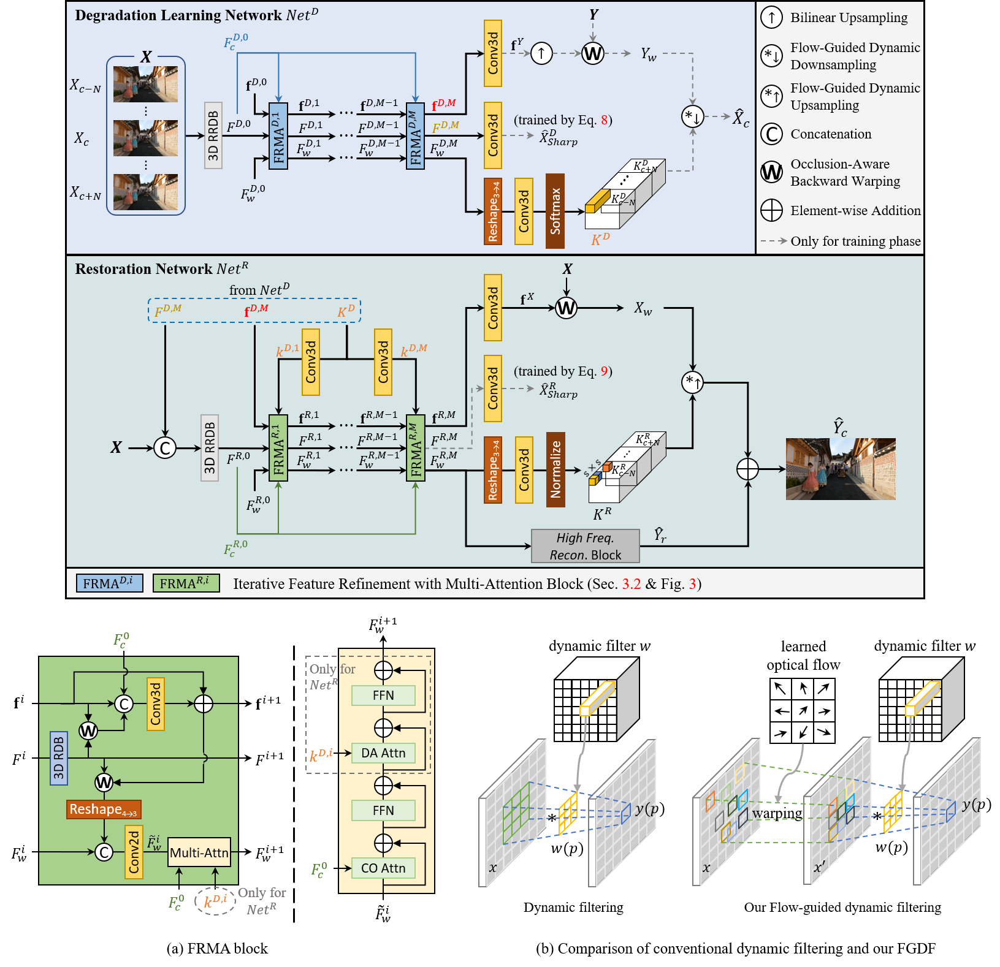

<h2>FMA-Net: Flow-Guided Dynamic Filtering and Iterative Feature Refinement with Multi-Attention for Joint Video Super-Resolution and Deblurring</h2>

    
    <a href='https://www.viclab.kaist.ac.kr/' target='_blank'>Geunhyuk Youk1</a>&nbsp;
    <a href='https://sites.google.com/view/ozbro/' target='_blank'>Jihyong Oh† 2</a>&nbsp;
    <a href='https://www.viclab.kaist.ac.kr/' target='_blank'>Munchurl Kim† 1</a>

    †Co-corresponding authors

    1Korea Advanced Institute of Science and Technology, South Korea

    2Chung-Ang University, South Korea

    <h4 align="center">
        
        
        
        
    </h4>

---

    <h4>
        This repository is the official PyTorch implementation of "FMA-Net: Flow-Guided Dynamic Filtering and Iterative Feature Refinement with Multi-Attention for Joint Video Super-Resolution and Deblurring". FMA-Net achieves state-of-the-art performance in joint video super-resolution and deblurring (VSRDB).
    </h4>

    

    <h4>
        Please visit our <a href="https://kaist-viclab.github.io/fmanet-site/" target='_blank'>project page</a> for more visual results.
    </h4>

## 🎬 Network Architecture

<h4>
    Codes and pretrained models will be updated soon.
</h4>